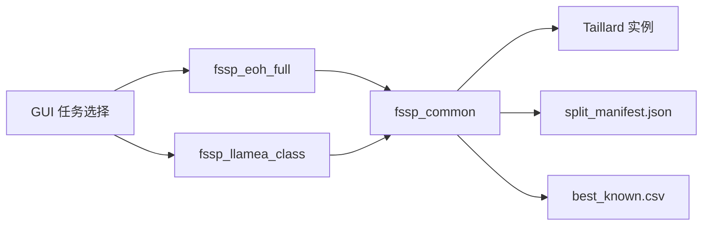
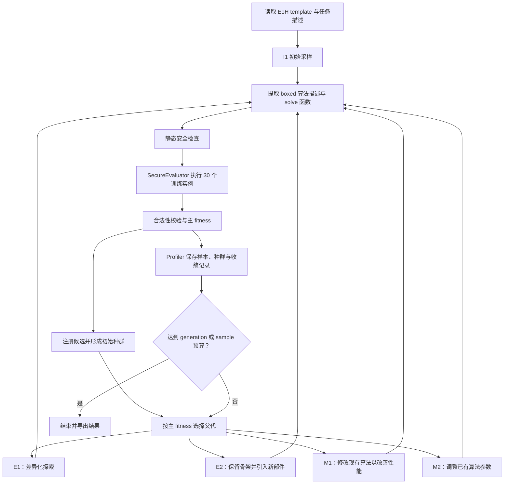
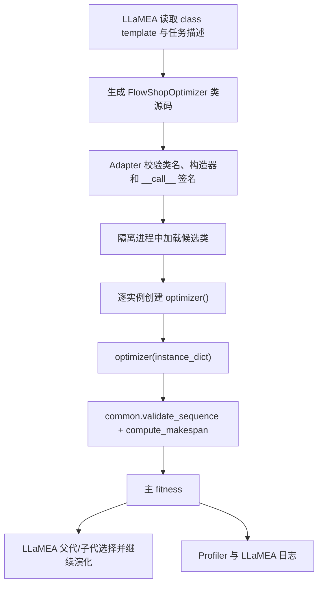

# FSSP 完整算法实验说明

本文档说明 `llm4ad/task/experiment/` 下的置换流水车间调度（Permutation Flow Shop Scheduling Problem，FSSP）完整算法实验，包括公共数据协议、EoH 函数式候选、LLaMEA 优化器类候选、评价指标、GUI 使用方式和代码文件职责。

## 1. 实验目标

给定 `n` 个作业和 `m` 台机器，每台机器上的作业加工顺序相同，加工时间由 `n × m` 矩阵给出。目标是确定一个作业的加工排列，使得所有作业在最后一台机器上的完成时间（makespan）最小。

本实验要求大语言模型生成“完整算法”，而不是只生成优先级函数、评分函数或算法中的单个组件：

- EoH 生成一个从完整实例直接构造完整作业排列的 `solve` 函数；
- LLaMEA 生成一个可包含多个成员方法的完整 `FlowShopOptimizer` 类；
- evaluator 只负责加载实例、检查排列合法性、重新计算 makespan、计算 fitness，不替候选修复解。

## 2. 目录结构

```text
llm4ad/task/experiment/
├── fssp_common/
│   ├── __init__.py
│   ├── dataset.py
│   ├── evaluation_core.py
│   ├── split_manifest.json
│   ├── best_known.csv
│   └── README.zh-CN.md
├── fssp_eoh_full/
│   ├── __init__.py
│   ├── evaluation.py
│   ├── template.py
│   └── paras.yaml
└── fssp_llamea_class/
    ├── __init__.py
    ├── evaluation.py
    ├── template.py
    └── paras.yaml
```

依赖方向如下：



`fssp_common` 是支持包，没有 `paras.yaml`，因此不会作为独立任务出现在 GUI 中。

## 3. 数据集

### 3.1 CO-Bench / Taillard 实例

实验使用 CO-Bench 中提供的 Taillard 流水车间调度实例：

- HuggingFace 数据集：<https://huggingface.co/datasets/CO-Bench/CO-Bench>
- 对应目录：`Flow shop scheduling`
- 原始作者：Éric Taillard
- 参考文献：Taillard (1993), *Benchmarks for basic scheduling problems*, European Journal of Operational Research 64(2), 278–285。
- DOI：<https://doi.org/10.1016/0377-2217(93)90182-M>

所选实例属于经典的 Taillard 系列（`tai{n}_{m}`），长期在 FSSP 启发式与元启发式研究中使用，比临时随机生成实例更适合作为正式对照基准。当前协议只包含一个实例族（Taillard），因此没有单独的“跨族测试 split”；未参与训练的规模用于跨规模泛化测试。

### 3.2 本地位置与文件格式

当前默认数据根目录由 `dataset.py` 相对仓库推导为：

```text
LLM4AD/data/benchmarks/fssp/
```

也可以通过 evaluator 的 `data_root` 参数覆盖。实例位于其 `extracted/` 子目录。

每个实例文件采用 CO-Bench 单实例格式：

```text
第一行：header label（如 "number of jobs, number of machines, initial seed, upper bound and lower bound :"）
第二行：n m seed upper_bound lower_bound
第三行："processing times :"
后续 m 行：每台机器上 n 个作业的整数加工时间
```

解析器将上述机器优先的 `m × n` 数据转置为作业优先的 `n × m` 矩阵，即 `matrix[j][k]` 表示作业 `j` 在机器 `k` 上的加工时间。解析器拒绝非整数、非正加工时间、行数/列数不匹配等数据错误。

### 3.3 固定数据划分

`split_manifest.json` 固定记录每个实例的相对路径、实例 ID、族、子系列、规模及 split。运行时不重新随机抽样。

| Split | 数量 | 用途 |
|---|---:|---|
| `train` | 30 | EoH/LLaMEA 搜索 fitness |
| `validation` | 30 | 同系列、更大规模泛化验证 |
| `test_cross_scale` | 60 | 更大规模泛化测试 |
| 合计 | 120 | 当前冻结协议覆盖范围 |

训练集和验证集均为：

| 子系列 | 规模（作业数×机器数） | 每个 split 的数量 |
|---|---:|---:|
| tai20_5 | 20 jobs, 5 machines | 10 |
| tai20_10 | 20 jobs, 10 machines | 10 |
| tai20_20 | 20 jobs, 20 machines | 10 |
| tai50_5 | 50 jobs, 5 machines | 10 |
| tai50_10 | 50 jobs, 10 machines | 10 |
| tai50_20 | 50 jobs, 20 machines | 10 |

跨规模测试包含：

- tai100_5：10 个；
- tai100_10：10 个；
- tai100_20：10 个；
- tai200_10：10 个；
- tai200_20：10 个；
- tai500_20：10 个。

测试 split 不应参与搜索、种群选择或参数调整。

### 3.4 Best-known 值

原始实例文件只给出 upper_bound / lower_bound，不内嵌最优 makespan。`best_known.csv` 单独维护：

```text
instance_id,best_known_value,status,source,checked_date
```

当前 manifest 中 120 个实例的参考值均来自 CO-Bench/CO-Bench `Flow shop scheduling` 数据集提供的 upper_bound，状态标记为 `BEST_KNOWN`。这些值是文献中广泛使用的 best-known makespan，但**并非全部由精确算法证明最优**。因此训练 split 采用的状态为 `BEST_KNOWN`，符合 fail-closed 规则（训练参考必须是 `OPTIMAL` 或 `BEST_KNOWN` 且有来源）。

`evaluation_core.py` 支持 `OPTIMAL`、`BEST_KNOWN`、`LOWER_BOUND` 和 `UNVERIFIED` 四种状态，但训练 split 要求参考状态为 `OPTIMAL` 或 `BEST_KNOWN`，否则 evaluator 初始化失败。

## 4. 统一解格式与合法性

两个方法必须返回一个 1-indexed 的作业排列，即 `[1, 3, 2, 4]` 形式。

约束如下：

1. 返回值必须是序列（list/tuple/numpy 一维数组等），不能是字典或标量；
2. 每个元素是原始的 1-based 作业索引，不是加工时间；
3. 每个索引 `1..n` 必须恰好出现一次；
4. 不允许缺失、重复、越界、布尔值或非整数作业编号；
5. 输出长度必须等于 `n`；
6. makespan 由 evaluator 根据实例和排列重新计算，候选不能返回 raw makespan 值让 evaluator 直接采用。

任一实例返回非法排列、抛出异常或超时，整个候选返回 `None`。evaluator 不跳过失败实例，也不修复候选输出。

## 5. Fitness

对实例 `i`，候选 makespan 为 `C_i`，参考 best-known makespan 为 `C_i*`：

```text
gap_i = (C_i - C_i*) / C_i*
```

训练集包含三个子系列（tai20_5、tai20_10、tai20_20）。先在每个子系列内部平均，再对三个子系列等权平均：

```text
primary_fitness = -mean(series_mean_gap)
```

因此：

- fitness 越大越好；
- `0` 表示所有训练实例均达到参考 best-known makespan；
- `-0.04` 表示宏平均 gap 约为 4%；
- 不能把负 fitness 理解为负的 makespan。

### 5.1 EoH 同分处理

FSSP 的 makespan 是连续目标，通常不需要额外的 tie-break。当前 `fssp_eoh_full` 的 evaluator 直接返回主 fitness；如果后续发现大量同分影响选择，可以参照 BP 1D 添加集中度 tie-break，但应在协议升级时统一更新 `fssp_common` 与两个方法任务。

## 6. EoH 候选函数

### 6.1 输入

```python
def solve(
    instance_id: str,
    n: int,
    m: int,
    matrix: list[list[int]],
) -> list[int]:
    ...
```

| 参数 | 含义 |
|---|---|
| `instance_id` | 稳定实例标识符 |
| `n` | 作业数量 |
| `m` | 机器数量 |
| `matrix` | `n × m` 加工时间矩阵，`matrix[j][k]` 为作业 `j` 在机器 `k` 上的加工时间 |

EoH 接收 `instance_id` 主要用于日志与调试；候选不应利用它硬编码训练答案。

### 6.2 输出

输出遵循第 4 节的统一格式：1-indexed 作业排列。函数必须在函数体内部完成构造和改进，不能依赖顶层辅助函数。

候选代码还会经过静态检查，禁止导入通用优化器或执行外部 I/O，包括 SciPy optimizer、OR-Tools、PuLP、python-mip、CVXPY、网络、文件、子进程、`eval` 和 `exec`。

### 6.3 一次宏观进化流程



初始化阶段最多尝试 `min(max_sample_nums, 2 * pop_size)` 个候选；无效候选不进入初始种群。初始化后，E1/E2/M1/M2 按配置循环执行。相同代码被视为重复项；主 fitness 相同但代码不同的候选仍可参与选择。

## 7. LLaMEA 候选类

### 7.1 类契约

```python
class FlowShopOptimizer:
    def __init__(self):
        ...

    def __call__(self, instance: dict) -> list[int]:
        ...
```

evaluator 的 class metadata 为：

```python
candidate_type = "class"
candidate_name = "FlowShopOptimizer"
candidate_call_signature = ("instance",)
supported_methods = ("LLaMEA",)
```

`instance` 当前包含：

```python
{
    "instance_id": str,
    "n": int,
    "m": int,
    "matrix": list[list[int]],
    "family": str,
    "subseries": str,
}
```

LLaMEA 可以在类中定义多个成员方法，用于构造、局部搜索、扰动或有界改进。每评价一个实例，evaluator 都创建新的 optimizer 对象并传入新的字典和 `matrix` 副本，防止跨实例状态污染。

### 7.2 宏观调用流程



## 8. EoH 与 LLaMEA 对照关系

| 项目 | EoH | LLaMEA |
|---|---|---|
| 候选表示 | 单个完整 `solve` 函数 | 完整 optimizer 类 |
| 支持方法 | `EoH` | `LLaMEA` |
| 训练实例 | 同一 `train` split | 同一 `train` split |
| 参考 best-known | 同一 CSV | 同一 CSV |
| 解校验 | `common.validate_sequence` | `common.validate_sequence` |
| makespan 计算 | `common.compute_makespan` | `common.compute_makespan` |
| 主 fitness | 相同 | 相同 |
| 每实例输入副本 | 是 | 是 |
| 内部同分机制 | 当前无额外 tie-break | 由 LLaMEA 自身选择机制决定 |

当前 baseline 实测主 fitness：

```text
EoH primary    = -0.03856496869909736
LLaMEA primary = -0.03856496869909736  （与 EoH 共用同一 baseline 启发式）
```

baseline 采用简化的 NEH 式构造：按作业总加工时间降序排序，再逐个插入当前排列的使 makespan 最小的位置。训练集 30 个实例的评价耗时约 0.09 秒。

## 9. 文件职责

### 9.1 `fssp_common`

| 文件 | 作用 |
|---|---|
| `__init__.py` | 导出公共数据类型、加载器、校验、fitness 和 reference API |
| `dataset.py` | 定义 `FSSPInstance`/`ManifestEntry`，解析 CO-Bench/Taillard 实例文件，读取 manifest 和 split |
| `evaluation_core.py` | 校验作业排列合法性，使用经典流水车间递推计算 makespan，计算 relative gap 与宏平均主 fitness |
| `split_manifest.json` | 冻结 120 个实例的训练/验证/跨规模测试划分 |
| `best_known.csv` | 保存每个实例的 best-known makespan、状态、来源和核验日期 |
| `README.zh-CN.md` | 本综合实验说明 |

### 9.2 `fssp_eoh_full`

| 文件 | 作用 |
|---|---|
| `__init__.py` | 导出 `FSSPEoHFullEvaluation` |
| `template.py` | 定义 EoH 的函数模板、候选契约、任务 prompt 和 NEH 式 baseline |
| `evaluation.py` | 加载 split/reference，静态拦截外部求解器，评价完整函数，计算主 fitness |
| `paras.yaml` | GUI evaluator 名称、30 秒 timeout、可选 data root 和默认 `train` split |

EoH 方法本身还涉及：

| 文件 | 作用 |
|---|---|
| `llm4ad/method/eoh/eoh.py` | 初始化种群、调度采样/评价、执行进化主循环 |
| `population.py` | 去重、种群生存、父代选择、fitness 排序 |
| `prompt.py` | 构建 I1、E1、E2、M1、M2 prompt |
| `sampler.py` | 调用 LLM，提取 `boxed` 算法描述和函数源码 |
| `profiler.py` | 保存候选和种群演化记录 |
| `resume.py` | 从既有记录恢复 EoH 运行 |
| `paras.yaml` | EoH 方法预算、种群和并发参数 |

### 9.3 `fssp_llamea_class`

| 文件 | 作用 |
|---|---|
| `__init__.py` | 导出 `FSSPLLAMEAClassEvaluation` |
| `template.py` | 定义 `FlowShopOptimizer` 类模板、任务描述和 baseline |
| `evaluation.py` | 校验 class candidate，逐实例创建 optimizer，调用 common 协议并计算主 fitness |
| `paras.yaml` | GUI evaluator 名称、30 秒 timeout、可选 data root 和默认 `train` split |

LLaMEA 方法适配层主要涉及：

| 文件 | 作用 |
|---|---|
| `llm4ad/method/llamea/llamea.py` | 将 GUI 参数映射到 LLaMEA，协调预算、并发、prompt 和日志目录 |
| `evaluation.py` | 加载函数/类候选，校验签名，在安全进程中执行并实施硬 timeout |
| `llamea_llm.py` | 提供符合 LLaMEA 上游接口的 LLM 适配 |
| `sampler.py` | LLaMEA 采样适配 |
| `paras.yaml` | LLaMEA 方法参数 |

## 10. GUI 与日志

在 GUI 中选择：

1. Task category：`experiment`；
2. Task：`fssp_eoh_full` 或 `fssp_llamea_class`；
3. Method：分别选择 `EoH` 或 `LLaMEA`；
4. evaluator 默认 `split=train`、`timeout_seconds=30`；
5. `data_root` 留空时使用默认数据目录。

任务声明 `supported_methods`，错误的方法/任务组合会在运行前被拒绝。

GUI profiler 日志目录：

```text
GUI/logs/eoh/<run>/
GUI/logs/llamea/<run>/
```

关闭“正式保存”时进入对应方法的 `test/` 子目录。EoH 通常保存 samples、population、run log、收敛 CSV 和 PNG。LLaMEA 还会保存上游实验目录，并通过 `llamea_output_dir.txt` 与 GUI profiler 目录关联。

## 11. 运行结果解读

- 首先检查有效候选比例；大量 `None` 通常说明排列索引、长度、重复或越界处理错误；
- 再检查主 fitness；越接近 `0` 表示宏平均 gap 越小；
- 相同主 fitness 不一定表示代码相同，但可能在所有训练实例上达到了相同的相对 gap；
- 正式报告应分别给出 train、validation 和 cross-scale 结果；
- 不应根据测试 split 调整 prompt、算法参数或搜索预算。

## 12. 验证

建议运行：

```bash
.venv/bin/python -m unittest tests.test_fssp_eoh_full -v
.venv/bin/python -m unittest tests.test_fssp_llamea_class -v
.venv/bin/python -m unittest tests.test_bp_1d_eoh_full -v
.venv/bin/python -m compileall -q llm4ad tests GUI/run_gui.py
```

截至 2026-07-08，`tests.test_fssp_eoh_full` 全部通过；`fssp_llamea_class` 完成后应补充对应测试并保证无回归。

## 13. 已知限制与公平性注意事项

1. 当前协议只包含 Taillard 一个实例族，因此没有独立的 `test_cross_family` split；泛化能力主要通过 `validation` 和 `test_cross_scale` 检验；
2. 所有参考值状态为 `BEST_KNOWN`，不是 `OPTIMAL`；报告时应明确说明 gap 是相对于 best-known 而非已证明最优；
3. 训练规模集中在 20 个作业，必须通过 50/100/200/500 规模的 split 检验泛化；
4. EoH 与 LLaMEA 当前都接收 `instance_id`，候选不应利用它硬编码训练答案；若需要最严格的接口公平性，可在后续协议版本中移除该字段；
5. EoH evaluator 有显式 AST 外部求解器/I/O 禁令；LLaMEA 主要依靠 adapter 隔离环境和 prompt 契约。正式对照前应确认两边允许的依赖范围一致；
6. 当前主 fitness 对照是公平的，但 EoH 和 LLaMEA 的种群、变异、同分选择机制本来就不同，这些属于待比较的方法差异；
7. 不要修改冻结的 manifest 或 best-known CSV 后仍沿用同一协议版本名称。
